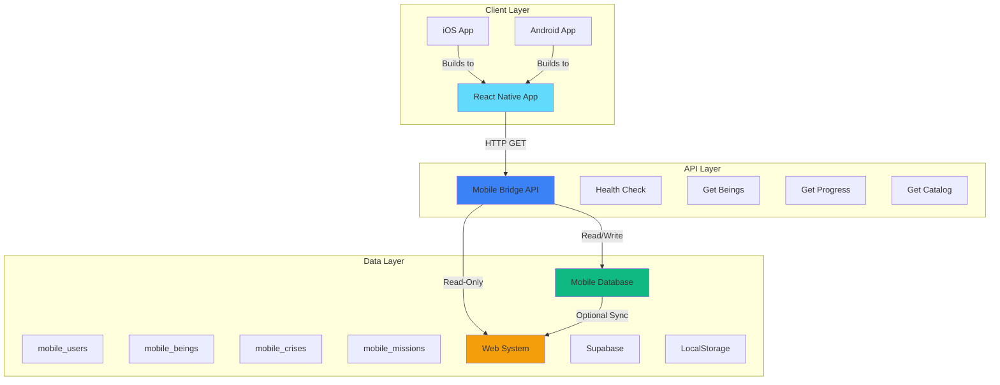
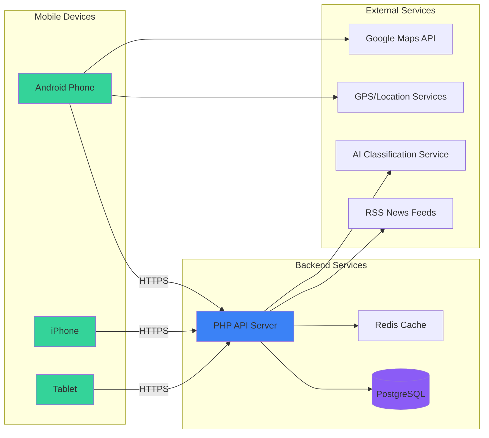
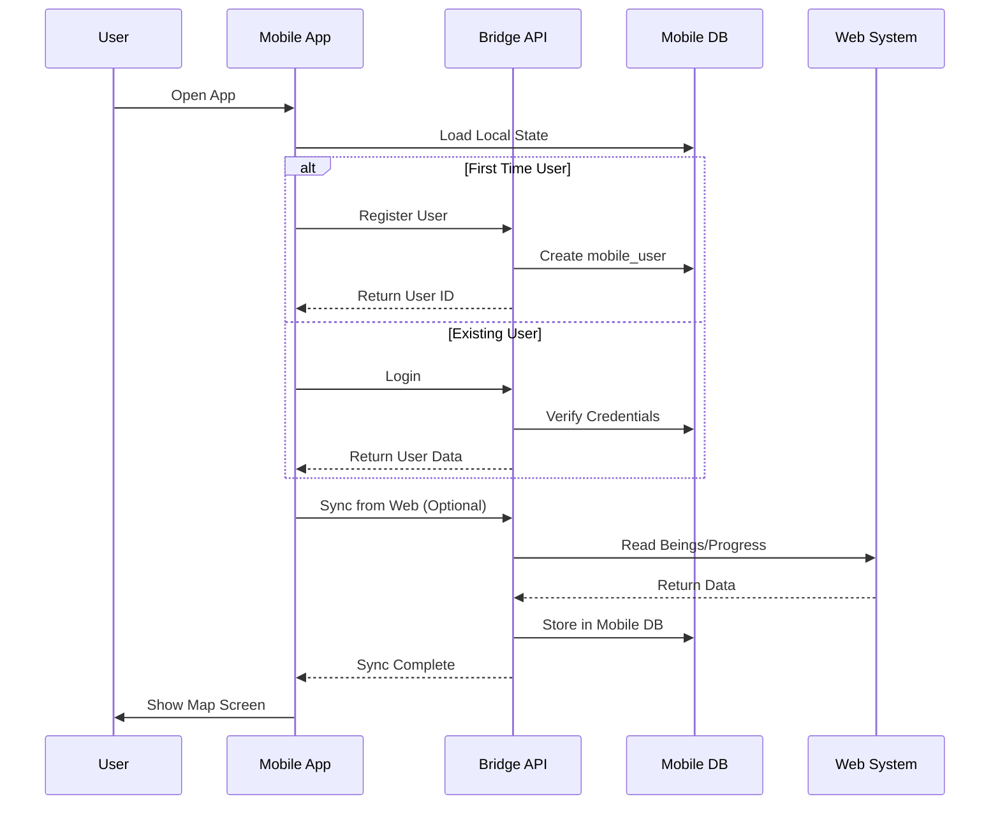
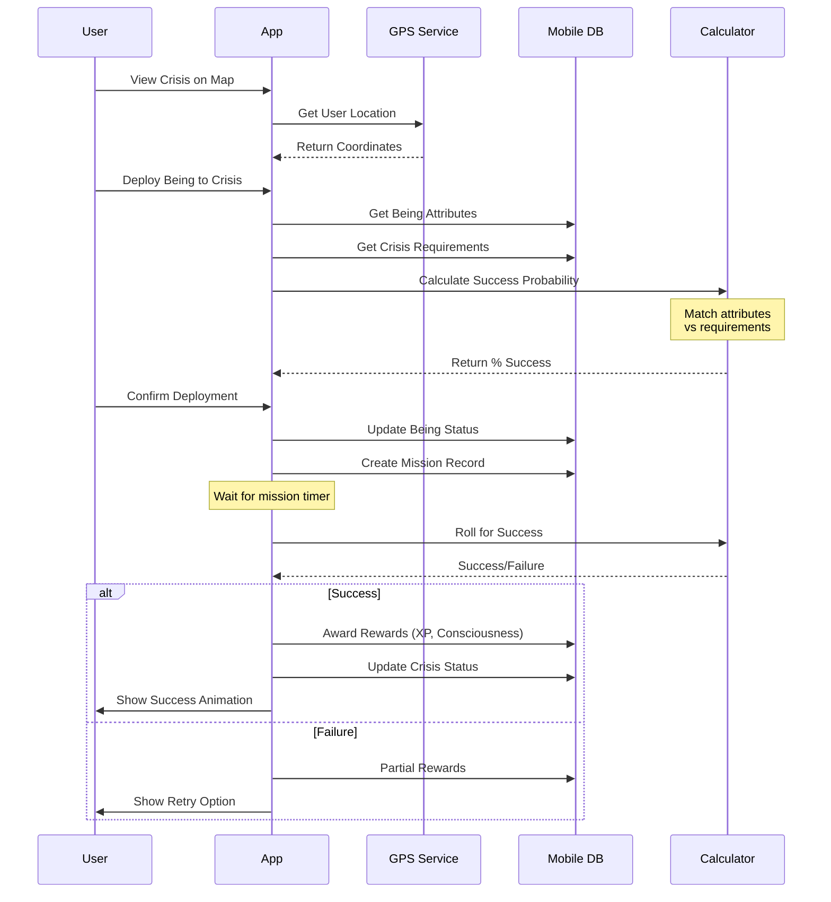
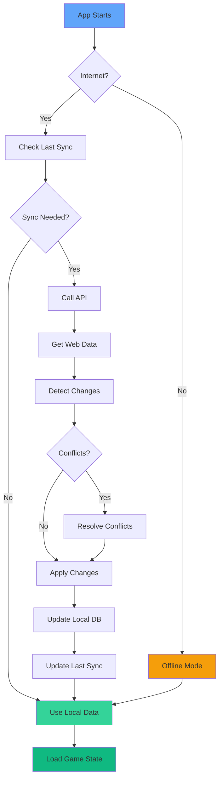
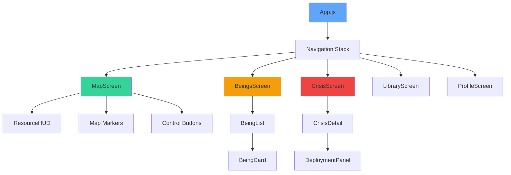
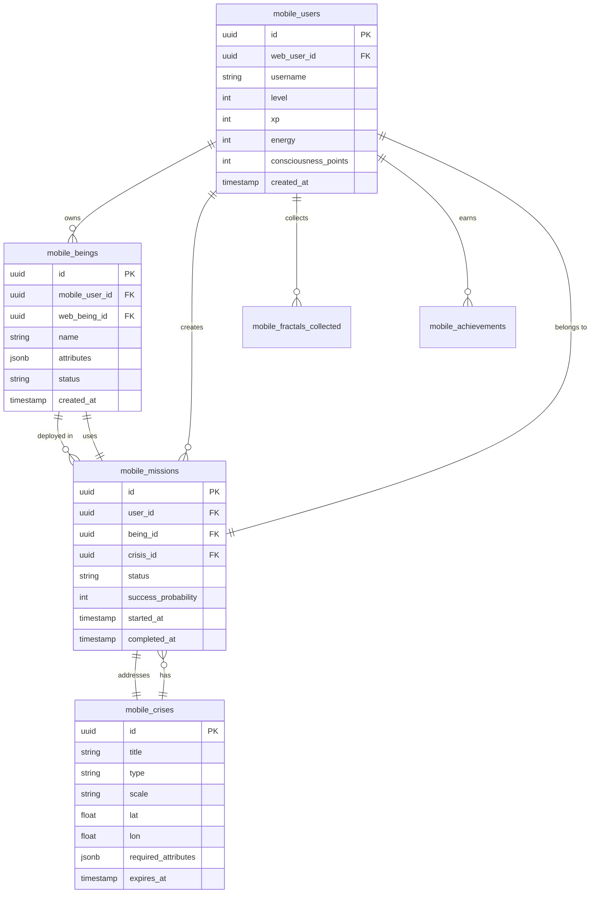
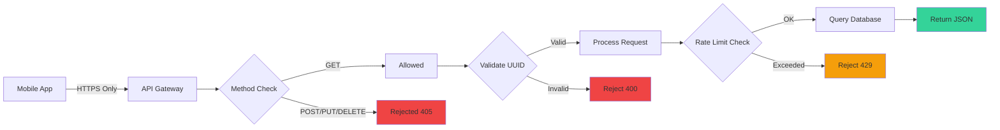
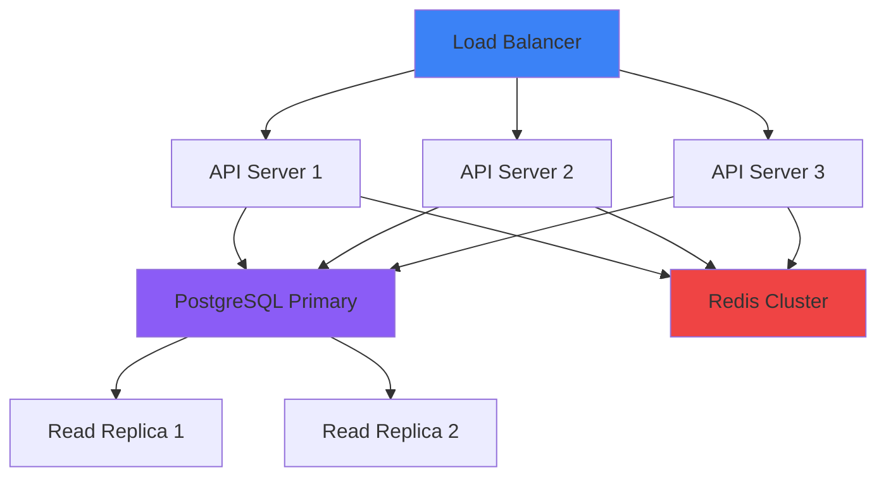

# Architecture Documentation


## Table of Contents

- [Overview](#overview)
- [System Architecture](#system-architecture)
- [Technology Stack](#technology-stack)
- [Data Flow](#data-flow)
- [Component Architecture](#component-architecture)
- [Database Design](#database-design)
- [Security Architecture](#security-architecture)
- [Design Decisions](#design-decisions)
- [Patterns & Principles](#patterns--principles)

---

## Overview

**Awakening Protocol** is a location-based mobile game that combines real-world exploration with transformative content from the "Colección Nuevo Ser" digital library. The architecture follows a **non-invasive design principle**, ensuring complete isolation from the existing web system.

### Core Principles

1. **Non-Invasive**: Zero modifications to existing web system
2. **Isolated**: Separate database with `mobile_` prefix on all tables
3. **Read-Only by Default**: API only reads from web, never writes
4. **Offline-First**: Full functionality without internet connection
5. **Scalable**: Designed to support thousands of concurrent users

---

## System Architecture

### High-Level Overview



### Deployment Architecture



---

## Technology Stack

### Frontend (Mobile)

| Technology | Version | Purpose |
|------------|---------|---------|
| **React Native** | 0.73.2 | Cross-platform mobile framework |
| **React** | 18.2.0 | UI library |
| **Zustand** | 4.4.7 | State management |
| **React Navigation** | 6.1.9 | Navigation system |
| **React Native Maps** | 1.10.0 | Map integration |
| **Geolocation Service** | 5.3.1 | GPS tracking |
| **AsyncStorage** | 1.21.0 | Local persistence |
| **React Native SVG** | 14.1.0 | Vector graphics |
| **Vector Icons** | 10.0.3 | Icon library |
| **date-fns** | 3.0.6 | Date utilities |

### Backend (API)

| Technology | Version | Purpose |
|------------|---------|---------|
| **PHP** | 8.1+ | API server |
| **PostgreSQL** | 14+ | Primary database |
| **Redis** | 7.0+ | Caching layer (optional) |
| **Supabase** | Latest | Optional backend service |

### Development Tools

| Tool | Purpose |
|------|---------|
| **ESLint** | Code linting |
| **Prettier** | Code formatting |
| **Jest** | Unit testing |
| **Metro Bundler** | JavaScript bundling |
| **Gradle** | Android builds |
| **Xcode** | iOS builds |

---

## Data Flow

### User Authentication Flow



### Crisis Resolution Flow



### Synchronization Flow



---

## Component Architecture

### Mobile App Structure

```
mobile-app/
├── src/
│   ├── screens/           # Screen components
│   │   ├── MapScreen.js         # Main game map
│   │   ├── BeingsScreen.js      # Being management (TODO)
│   │   ├── CrisisScreen.js      # Crisis details (TODO)
│   │   ├── LibraryScreen.js     # Integrated library (TODO)
│   │   └── ProfileScreen.js     # User profile (TODO)
│   │
│   ├── components/        # Reusable components
│   │   ├── BeingCard.js         # Being display card
│   │   ├── CrisisMarker.js      # Map marker for crisis
│   │   ├── FractalMarker.js     # Map marker for fractals
│   │   ├── ResourceBar.js       # Energy/Consciousness UI
│   │   └── MissionTimer.js      # Mission countdown
│   │
│   ├── services/          # Business logic
│   │   ├── SyncService.js       # Web↔Mobile sync
│   │   ├── LocationService.js   # GPS tracking
│   │   ├── MissionService.js    # Mission logic
│   │   └── CalculatorService.js # Game calculations
│   │
│   ├── stores/            # State management
│   │   └── gameStore.js         # Zustand global store
│   │
│   ├── config/            # Configuration
│   │   └── constants.js         # Game constants
│   │
│   ├── utils/             # Utilities
│   │   ├── distance.js          # Geolocation math
│   │   ├── validators.js        # Input validation
│   │   └── formatters.js        # Data formatting
│   │
│   └── assets/            # Static resources
│       ├── images/
│       ├── sounds/
│       └── fonts/
```

### Component Hierarchy



---

## Database Design

### Entity Relationship Diagram



### Key Tables

#### mobile_users
Stores game player data, completely separate from web users.

**Key Fields:**
- `level`: Player level (1-50)
- `xp`: Experience points for progression
- `energy`: Current energy (regenerates 1/min)
- `consciousness_points`: Premium currency earned through gameplay
- `sync_mode`: 'read-only', 'bidirectional', or 'offline'

#### mobile_beings
Transformative beings that players deploy to solve crises.

**Key Fields:**
- `attributes`: JSONB with 15 attribute types (0-100 each)
- `status`: 'available', 'deployed', 'resting', 'training'
- `web_being_id`: Reference to original being in Frankenstein Lab (optional)
- `synced_from_web`: Boolean flag for sync tracking

#### mobile_crises
Real-world crises that players address with their beings.

**Key Fields:**
- `source`: 'rss', 'predefined', 'user_generated'
- `required_attributes`: JSONB with minimum attribute requirements
- `scale`: 'local', 'regional', 'national', 'global'
- `urgency`: 1-10 severity rating

#### mobile_missions
Active deployments of beings to crises.

**Key Fields:**
- `success_probability`: Calculated % based on attribute match
- `duration_minutes`: Time required to complete
- `rewards`: JSONB with XP, consciousness, etc.

---

## Security Architecture

### API Security



### Security Measures

1. **Read-Only API by Default**
   - Only GET requests allowed
   - Explicit rejection of POST/PUT/DELETE
   - No write operations to web system

2. **Input Validation**
   - UUID format validation
   - SQL injection prevention
   - XSS protection on all inputs

3. **Rate Limiting**
   - 100 requests/minute per user
   - 1000 requests/hour per IP
   - Exponential backoff on failures

4. **Data Isolation**
   - Separate database schema (`mobile_` prefix)
   - Optional foreign keys to web system
   - No cascading deletes to web tables

5. **Authentication**
   - JWT tokens for API access
   - Refresh token rotation
   - Session management

6. **HTTPS Enforcement**
   - All API calls over TLS 1.3
   - Certificate pinning in production
   - HSTS headers enabled

---

## Design Decisions

### Why React Native?

**Pros:**
- ✅ Single codebase for iOS + Android
- ✅ JavaScript/React familiarity
- ✅ Large community and ecosystem
- ✅ Hot reload for fast development
- ✅ Native performance for critical features

**Cons:**
- ❌ Slightly larger app size than native
- ❌ Occasional platform-specific bugs
- ❌ Bridge overhead for intensive operations

**Decision:** Benefits outweigh drawbacks for this project.

---

### Why Zustand over Redux?

**Comparison:**

| Feature | Zustand | Redux |
|---------|---------|-------|
| Boilerplate | Minimal | High |
| Learning Curve | Low | Steep |
| Bundle Size | 1KB | 15KB+ |
| DevTools | Yes | Yes |
| Middleware | Yes | Yes |

**Decision:** Zustand provides 90% of Redux benefits with 10% of the complexity.

---

### Why AsyncStorage?

**Comparison:**

| Storage | Pros | Cons |
|---------|------|------|
| **AsyncStorage** | Built-in, simple API, cross-platform | Limited to 6MB, slower than SQLite |
| **SQLite** | Fast, unlimited storage, SQL queries | Requires native module, more complex |
| **Realm** | Fast, reactive, cross-platform | Large bundle, steep learning curve |

**Decision:** AsyncStorage for MVP, migrate to SQLite if storage limits are hit.

---

### Why PHP for API?

**Rationale:**
1. Already used in existing web system
2. Simple deployment to existing server
3. Excellent for read-only endpoints
4. Mature database libraries
5. Easy to maintain alongside web code

**Alternative Considered:** Node.js (rejected for consistency with existing stack)

---

## Patterns & Principles

### Design Patterns Used

1. **Repository Pattern**
   - `SyncService.js` abstracts data access
   - Easy to swap backends (Supabase ↔ Local)

2. **Observer Pattern**
   - Zustand for reactive state management
   - Components auto-update on state changes

3. **Factory Pattern**
   - Fractal generation based on location
   - Crisis creation from RSS feeds

4. **Strategy Pattern**
   - Different sync modes: read-only, bidirectional, offline
   - Pluggable attribute calculators

5. **Singleton Pattern**
   - `SyncService` single instance
   - `gameStore` global state

### SOLID Principles

- **Single Responsibility**: Each service handles one concern
- **Open/Closed**: Easy to add new being attributes without modifying core logic
- **Liskov Substitution**: All crisis types implement same interface
- **Interface Segregation**: Separate interfaces for read/write operations
- **Dependency Inversion**: Services depend on abstractions, not concrete implementations

### Code Organization Principles

1. **Separation of Concerns**
   - UI in components
   - Logic in services
   - State in stores
   - Config in constants

2. **DRY (Don't Repeat Yourself)**
   - Reusable components
   - Shared utilities
   - Common constants

3. **KISS (Keep It Simple, Stupid)**
   - Avoid premature optimization
   - Clear, readable code over clever tricks
   - Simple solutions preferred

4. **Offline-First**
   - All features work without internet
   - Sync happens in background
   - Graceful degradation

---

## Performance Considerations

### Optimization Strategies

1. **Map Rendering**
   - Only render visible markers
   - Cluster nearby fractals
   - Throttle location updates to 10s

2. **State Management**
   - Persist only essential state
   - Use selectors to prevent re-renders
   - Batch state updates

3. **API Calls**
   - Cache responses for 5 minutes
   - Debounce sync requests
   - Background sync when app inactive

4. **Asset Loading**
   - Lazy load non-critical components
   - Optimize images (WebP format)
   - Preload critical assets

### Performance Metrics (Targets)

| Metric | Target | Current |
|--------|--------|---------|
| App Launch Time | < 2s | TBD |
| Map Frame Rate | 60 FPS | TBD |
| API Response Time | < 500ms | TBD |
| Sync Operation | < 5s | TBD |
| Memory Usage | < 200MB | TBD |
| Battery Drain | < 5%/hour | TBD |

---

## Scalability

### Horizontal Scaling



### Database Scaling Strategy

1. **Read Replicas**: For high read volume
2. **Connection Pooling**: Reduce overhead
3. **Partitioning**: By user_id for large tables
4. **Archival**: Move old missions to archive tables

---

## Future Architecture Improvements

1. **GraphQL API**: Replace REST for flexible queries
2. **WebSocket**: Real-time multiplayer features
3. **CDN**: Serve static assets globally
4. **Microservices**: Split API into domain services
5. **Event Sourcing**: Full audit trail of game events

---

## References

- [React Native Documentation](https://reactnative.dev/)
- [Zustand Documentation](https://github.com/pmndrs/zustand)
- [PostgreSQL Best Practices](https://wiki.postgresql.org/wiki/Don't_Do_This)
- [Mobile App Security Guide](https://owasp.org/www-project-mobile-security/)

---

**Last Updated:** 2025-12-13
**Version:** 1.0.0
**Maintainer:** Awakening Protocol Team
