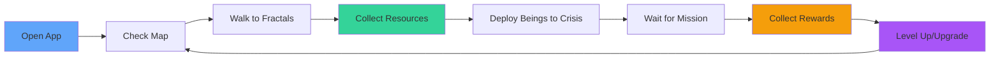
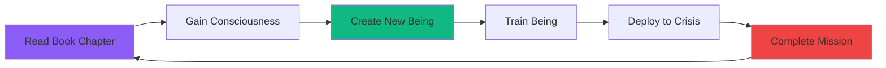
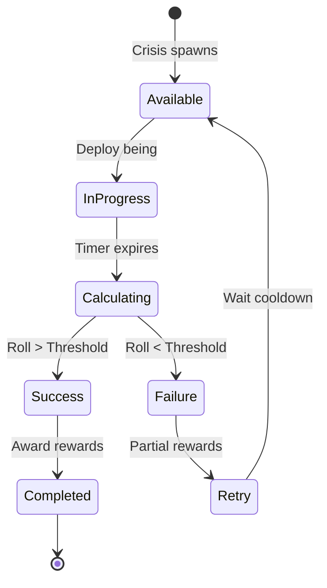
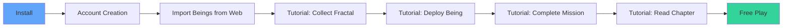

# Game Design Document


## Table of Contents

- [Game Overview](#game-overview)
- [Core Loop](#core-loop)
- [Game Mechanics](#game-mechanics)
- [Progression System](#progression-system)
- [Economy & Resources](#economy--resources)
- [Combat & Success Calculation](#combat--success-calculation)
- [Balance & Formulas](#balance--formulas)
- [Difficulty Curve](#difficulty-curve)

---

## Game Overview

### Concept

**"Pokémon GO meets Civilization with philosophical depth"**

Awakening Protocol is a location-based mobile game where players walk around their real-world environment to:
- Collect consciousness fractals
- Deploy transformative beings to solve real crises
- Read philosophical books to grow
- Build microsocieties

### Core Themes

- **Transformation**: Personal and societal change
- **Consciousness**: Awareness and intentional action
- **Real-World Impact**: Addressing actual crises
- **Cooperation**: Community-based problem solving

### Target Audience

- **Age**: 16-45 years old
- **Interests**: Philosophy, social change, gaming, reading
- **Playstyle**: Casual to moderate (15-60 min/day)
- **Geography**: Urban and suburban areas (needs POIs)

---

## Core Loop

### Primary Loop (Daily)



### Secondary Loop (Weekly)



### Meta Loop (Monthly)

1. **Progress through content**: Finish books, unlock new chapters
2. **Community events**: Global crises requiring cooperation
3. **Season rewards**: Cosmetic items, exclusive beings
4. **Leaderboards**: Compete with local/global players

---

## Game Mechanics

### 1. Exploration & Fractals

**Fractal Types:**

| Type | Icon | Spawn Locations | Cooldown | Rewards |
|------|------|-----------------|----------|---------|
| **Wisdom** | 📚 | Libraries, Schools, Universities | 30 min | +50 Knowledge, +20 Consciousness |
| **Community** | 🤝 | Town Halls, Community Centers | 30 min | +30 Cohesion, +15 Consciousness |
| **Nature** | 🌳 | Parks, Forests, Gardens | 30 min | +40 Regeneration, +15 Energy |
| **Action** | ⚡ | NGOs, Cooperatives | 30 min | +35 Action Points, +25 Consciousness |
| **Consciousness** | 🌟 | Meditation Centers, Temples | 60 min | +50 Consciousness, +20 Wisdom |

**Spawn Mechanics:**
- **Radius**: 2km around player
- **Density**: 5-10 fractals at any time
- **Activation**: Must be within 50m to collect
- **Respawn**: After cooldown expires
- **Weather Bonus**: Rain increases Nature fractals by 50%

**Collection Process:**
```
1. Player walks within 50m of fractal
2. Fractal pulses and becomes interactive
3. Player taps fractal marker
4. Animation plays (particle effect)
5. Rewards added to inventory
6. Fractal enters cooldown
```

---

### 2. Beings System

**Attributes (15 Total):**

Each being has 15 attributes rated 0-100:

| Category | Attributes | Use Cases |
|----------|-----------|-----------|
| **Mental** | Reflection, Analysis, Creativity | Intellectual crises, Research |
| **Social** | Empathy, Communication, Leadership, Collaboration | Community crises, Diplomacy |
| **Action** | Action, Resilience, Strategy | Environmental, Infrastructure |
| **Spiritual** | Consciousness, Connection, Wisdom | Humanitarian, Ethical dilemmas |
| **Practical** | Organization, Technical | Economic, Administrative |

**Being Creation:**

Beings are created by:
1. **Reading books** (synced from web app)
2. **Frankenstein Lab** (web interface)
3. **Fusion** (combining two beings in mobile app)

**Fusion Formula:**
```
NewBeing.attribute = (Being1.attribute + Being2.attribute) / 2 + Random(-5, +5)
```

**Being States:**
- **Available**: Ready to deploy
- **Deployed**: On a mission
- **Resting**: Recovering energy (1 hour)
- **Training**: Increasing attributes (4 hours)

---

### 3. Crisis System

**Crisis Types:**

| Type | Icon | Examples | Required Attributes |
|------|------|----------|---------------------|
| **Environmental** | 🌍 | Pollution, Deforestation | Action, Strategy, Technical |
| **Social** | 👥 | Inequality, Conflict | Empathy, Communication, Leadership |
| **Economic** | 💰 | Poverty, Unemployment | Organization, Collaboration, Strategy |
| **Humanitarian** | ❤️ | Refugee Crisis, Disaster | Empathy, Resilience, Connection |
| **Educational** | 📚 | Illiteracy, Access | Wisdom, Communication, Organization |
| **Health** | 🏥 | Epidemic, Mental Health | Empathy, Technical, Wisdom |
| **Infrastructure** | 🏗️ | Housing, Transport | Technical, Organization, Strategy |

**Crisis Sources:**
1. **RSS Feeds**: Real news (UN, Reuters, NGO reports)
2. **Predefined**: Curated scenarios
3. **User-Generated**: Player-submitted local issues (verified by community)

**Crisis Scales:**

| Scale | Radius | Duration | Difficulty | Rewards Multiplier |
|-------|--------|----------|------------|-------------------|
| **Local** | 5 km | 4 hours | Easy | 1x |
| **Regional** | 50 km | 12 hours | Medium | 2x |
| **National** | 500 km | 24 hours | Hard | 5x |
| **Continental** | 5000 km | 48 hours | Very Hard | 10x |
| **Global** | 20000 km | 72 hours | Extreme | 20x |

---

### 4. Mission System

**Mission Flow:**



**Mission Duration:**
```
duration_minutes = crisis_difficulty * 15 * (1 - player_level_bonus)

player_level_bonus = min(0.5, player_level / 100)
```

Examples:
- Level 1, Easy Crisis: 15 minutes
- Level 10, Medium Crisis: 21 minutes
- Level 50, Hard Crisis: 22.5 minutes (max reduction 50%)

---

## Progression System

### Levels (1-50)

**XP Requirements Formula:**
```
xp_required(level) = 100 * level^1.5

Level 1  → 0 XP (starting)
Level 2  → 100 XP
Level 5  → 1,118 XP
Level 10 → 3,162 XP
Level 20 → 8,944 XP
Level 50 → 35,355 XP
```

**Level Rewards:**

| Level | Name | Max Beings | Max Energy | Unlocks |
|-------|------|------------|------------|---------|
| 1 | Despertar | 3 | 100 | Basic fractals |
| 5 | Practicante | 8 | 200 | Being fusion |
| 10 | Transformador | 15 | 300 | Regional crises |
| 15 | Guía | 20 | 400 | Community features |
| 20 | Arquitecto | 30 | 500 | National crises |
| 30 | Maestro | 50 | 700 | Global crises |
| 50 | Nuevo Ser | 100 | 1000 | All features |

**Attribute Points:**
- +5 attribute points per level
- Can distribute across any being's attributes
- Max 100 per attribute

---

## Economy & Resources

### Primary Resources

#### 1. Energy ⚡

**Properties:**
- Starting: 100
- Maximum: 100-1000 (based on level)
- Regeneration: 1 per minute (passive)
- Uses: Deploy beings, training, fusion

**Consumption:**
```
Deploy Being:        -10 energy
Train Being:         -20 energy
Fuse Beings:         -50 energy
Speed Up Mission:    -5 energy/minute
```

**Regeneration Boost:**
- Premium Pass: 2/min
- Nature Fractals: +15 instant
- Meditation (in-app): +5/min for 10 min

---

#### 2. Consciousness 🌟

**Properties:**
- Starting: 0
- Maximum: Unlimited
- Acquisition: Reading, fractals, missions
- Uses: Create beings, premium features

**Earning Rates:**
```
Read Book Chapter:         +100 consciousness
Fractal Collection:        +10-50 (type dependent)
Mission Success:           +20-200 (difficulty dependent)
Daily Login:               +10
Community Event:           +500
```

**Spending:**
```
Create Being:              -200 consciousness
Upgrade Being Slot:        -500 consciousness
Unlock Premium Book:       -1000 consciousness
Cosmetic Item:             -100-500 consciousness
```

---

#### 3. Knowledge (Sub-Resource)

Gained from reading and wisdom fractals.
Used to unlock advanced being creation options.

---

### Economy Balance

**Daily Resource Flow (Active Player):**

| Resource | Earned | Spent | Net |
|----------|--------|-------|-----|
| Energy | +1440 (regen) + 45 (fractals) | -100 (deployments) | +1385 |
| Consciousness | +300 (reading) + 150 (fractals) + 200 (missions) | -200 (being creation) | +450 |

**Preventing Inflation:**
- Energy cap prevents hoarding
- Consciousness sinks (cosmetics, premium content)
- Time-gated content (weekly/monthly resets)

---

## Combat & Success Calculation

### Success Probability Formula

```javascript
function calculateSuccessProbability(being, crisis) {
  // 1. Calculate attribute match score
  let matchScore = 0;
  let totalRequired = 0;

  for (let attr in crisis.required_attributes) {
    const required = crisis.required_attributes[attr];
    const beingValue = being.attributes[attr] || 0;

    matchScore += Math.min(beingValue, required);
    totalRequired += required;
  }

  // 2. Base success rate (0-100%)
  const baseSuccess = (matchScore / totalRequired) * 100;

  // 3. Apply modifiers
  const levelBonus = Math.min(20, being.fitness * 0.2); // Max +20%
  const energyPenalty = being.energy < 50 ? -10 : 0;
  const crisisDifficultyMod = crisis.scale === 'global' ? -15 : 0;

  // 4. Final probability
  const finalProb = Math.max(5, Math.min(95,
    baseSuccess + levelBonus + energyPenalty + crisisDifficultyMod
  ));

  return Math.round(finalProb);
}
```

**Example Calculation:**

Crisis Requirements:
```json
{
  "empathy": 70,
  "communication": 60,
  "leadership": 50
}
```

Being Attributes:
```json
{
  "empathy": 85,
  "communication": 55,
  "leadership": 65
}
```

Calculation:
```
Match Score = min(85,70) + min(55,60) + min(65,50) = 70 + 55 + 50 = 175
Total Required = 70 + 60 + 50 = 180

Base Success = (175/180) * 100 = 97.2%

Level Bonus = 15% (fitness 75)
Energy Penalty = 0 (energy 100)
Crisis Difficulty = -5% (regional)

Final = 97.2 + 15 - 5 = 107.2 → capped at 95%
```

### Mission Outcome

**Success Roll:**
```javascript
function resolveMission(mission) {
  const roll = Math.random() * 100;
  const success = roll <= mission.success_probability;

  if (success) {
    return {
      success: true,
      rewards: mission.full_rewards
    };
  } else {
    // Partial rewards on failure
    return {
      success: false,
      rewards: {
        xp: mission.full_rewards.xp * 0.3,
        consciousness: mission.full_rewards.consciousness * 0.5
      }
    };
  }
}
```

**Rewards Scaling:**
```
base_xp = crisis_difficulty * 50
base_consciousness = crisis_difficulty * 20

Modifiers:
- First attempt: +50% XP
- Perfect match (100% probability): +30% all rewards
- Community mission: +20% consciousness
- Global crisis: +100% all rewards
```

---

## Balance & Formulas

### Resource Regeneration

**Energy:**
```
energy_per_minute = 1 + premium_bonus + temporary_buffs

Premium Bonus = is_premium ? 1 : 0
Temporary Buffs = active_meditation ? 4 : 0 (max 10 min)
```

**Being Recovery:**
```
recovery_time_minutes = 60 * (1 - consciousness_level_multiplier)

consciousness_level_multiplier = min(0.5, player_level / 100)

Level 1:  60 minutes
Level 25: 45 minutes
Level 50: 30 minutes (max reduction)
```

### Attribute Training

**Training Formula:**
```
attribute_gain = base_gain * diminishing_returns * quality_multiplier

base_gain = 5
diminishing_returns = 1 - (current_value / 100)^2
quality_multiplier = 1.0 (normal) | 1.5 (premium item) | 2.0 (event)

Examples:
- Train Empathy from 30 → 30 + (5 * 0.91 * 1.0) = 34.55 → 35
- Train Empathy from 80 → 80 + (5 * 0.36 * 1.0) = 81.8 → 82
```

### Fusion Mechanics

**Attribute Inheritance:**
```javascript
function fuseBe beings(being1, being2) {
  const newBeing = {};

  for (let attr in ATTRIBUTES) {
    const avg = (being1.attributes[attr] + being2.attributes[attr]) / 2;
    const variance = Math.random() * 10 - 5; // -5 to +5
    const capped = Math.max(0, Math.min(100, avg + variance));

    newBeing.attributes[attr] = Math.round(capped);
  }

  // Dominant attribute = highest from either parent
  const dominantAttr = getDominantAttribute([being1, being2]);
  newBeing.dominant_attribute = dominantAttr;

  return newBeing;
}
```

---

## Difficulty Curve

### Early Game (Levels 1-10)

**Focus:** Learning mechanics, exploration

- **Crisis Difficulty:** Mostly local (easy)
- **Success Rates:** 70-90%
- **Resource Flow:** Abundant
- **Tutorial:** Guided missions

### Mid Game (Levels 11-30)

**Focus:** Strategy, optimization

- **Crisis Difficulty:** Regional and national
- **Success Rates:** 50-80%
- **Resource Flow:** Balanced
- **Challenge:** Multi-being deployments

### Late Game (Levels 31-50)

**Focus:** Mastery, cooperation

- **Crisis Difficulty:** Continental and global
- **Success Rates:** 30-70%
- **Resource Flow:** Tight
- **Challenge:** Complex attribute matching, time management

### Endgame (Level 50)

**Focus:** Community, leaderboards

- **Crisis Difficulty:** Extreme global events
- **Success Rates:** 20-60%
- **Resource Flow:** Strategic
- **Challenge:** Cooperative missions requiring multiple players

---

## Engagement Loops

### Daily Engagement

- **Login Bonus**: +10 consciousness, +50 energy
- **Daily Mission**: Complete 1 crisis for bonus rewards
- **Fractal Respawn**: New fractals every 30-60 min
- **Reading Streak**: Consecutive days bonus (up to 7 days)

### Weekly Engagement

- **Community Event**: Global crisis requiring collective action
- **Leaderboard Reset**: Top 100 players get exclusive cosmetics
- **New Book Chapter**: Released every Monday
- **Limited-Time Crisis**: High-reward events (48 hours)

### Monthly Engagement

- **Season Pass**: Tiered rewards for active play
- **Global Leaderboard**: Top 10 featured in-app
- **New Being Types**: Monthly rotation of special beings
- **Themed Events**: Related to real-world awareness days

---

## Monetization (Ethical)

### Premium Pass ($4.99/month)

**Benefits:**
- 2x energy regeneration
- +5 being slots
- Early access to new book chapters
- Exclusive cosmetic items
- Ad-free experience

**NOT Included:**
- Gameplay advantages (no pay-to-win)
- Exclusive crisis access
- Attribute boosts

### Cosmetics ($0.99-$2.99)

- Being skins
- Map themes
- Particle effects
- Profile frames
- Emotes

### Consumables ($0.49-$0.99)

- Energy refill (100 energy)
- 2x XP boost (1 hour)
- Mission speed-up (reduce timer by 50%)

**All obtainable for free through gameplay.**

---

## Retention Strategies

### First-Time User Experience (FTUE)



### Retention Targets

| Metric | Target | Industry Avg |
|--------|--------|--------------|
| Day 1 Retention | 50% | 40% |
| Day 7 Retention | 25% | 20% |
| Day 30 Retention | 15% | 10% |
| Session Length | 20 min | 15 min |
| Sessions/Day | 3 | 2 |

### Churn Prevention

- **Re-engagement Notifications**: "A crisis near you needs attention!"
- **Comeback Rewards**: Extra energy for returning after 3+ days
- **Social Features**: Friend system, cooperative missions
- **Content Cadence**: New content every week

---

**Last Updated:** 2025-12-13
**Version:** 1.0.0
**Lead Designer:** Awakening Protocol Team
