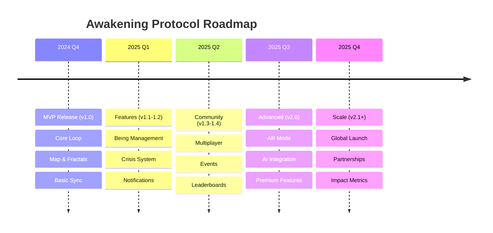

# Product Roadmap

## Vision

Transform how people engage with philosophical content and real-world challenges through an immersive, location-based mobile game that combines education, exploration, and social impact.

---

## Roadmap Overview

---

## Release History

### ✅ v1.0.0 - MVP (December 2024)

**Status:** Released
**Focus:** Core gameplay loop

**Features:**
- Interactive GPS map
- Fractal collection (5 types)
- Being system (15 attributes)
- Crisis deployment
- Web account sync (read-only)
- Resource management (Energy, Consciousness)
- Leveling system (1-50)

**Metrics:**
- Lines of Code: ~2,500
- API Endpoints: 5
- Database Tables: 9
- Test Coverage: TBD

---

## Near-Term Roadmap

### 🚧 v1.1.0 - Enhanced UI (January 2025)

**Status:** In Planning
**Timeline:** 4-6 weeks
**Focus:** User experience improvements

**Features:**
- [ ] Being management screen
  - Grid/list view toggle
  - Sort by attribute/status/recent
  - Quick actions (deploy, train, fuse)
  - Being detail modal

- [ ] Crisis detail screen
  - Full crisis information
  - Required attributes visualization
  - Historical success rate
  - Similar crises recommendation

- [ ] Mission dashboard
  - Active missions overview
  - Timer countdown
  - Success probability trends
  - Quick collect rewards

- [ ] Improved HUD
  - Animated resource bars
  - Level progress indicator
  - Quick stats popover

**Technical:**
- React Navigation modal stack
- Animated transitions
- Skeleton loaders
- Pull-to-refresh everywhere

**KPIs:**
- Session length: +20%
- User retention D7: >25%
- Feature discovery: >60%

---

### 🚧 v1.2.0 - Core Features (February 2025)

**Status:** Planned
**Timeline:** 6-8 weeks
**Focus:** Complete core gameplay

**Features:**
- [ ] Being fusion system
  - Visual fusion interface
  - Attribute preview
  - Fusion history
  - Special fusion combinations

- [ ] Training system
  - Train individual attributes
  - Training queue (3 max)
  - Premium training options
  - Training mini-games

- [ ] Push notifications
  - Mission complete
  - Fractal nearby
  - Energy refilled
  - Daily reminders
  - Smart scheduling (quiet hours)

- [ ] Achievement system
  - 50+ achievements
  - Progress tracking
  - Rewards (consciousness, cosmetics)
  - Share to social media

**Technical:**
- Firebase Cloud Messaging
- Local notifications
- Background task scheduling
- Achievement calculation engine

**KPIs:**
- DAU/MAU ratio: >30%
- Notification engagement: >40%
- Achievement completion: >5 per user

---

### 🔮 v1.3.0 - Community (March 2025)

**Status:** Planned
**Timeline:** 6-8 weeks
**Focus:** Social features

**Features:**
- [ ] Friend system
  - Add friends
  - View friend's progress
  - Gift energy/resources
  - Friend leaderboard

- [ ] Cooperative missions
  - Multi-player crises (2-5 players)
  - Shared rewards
  - Real-time coordination
  - Voice chat integration

- [ ] Guilds/Alliances
  - Create/join guilds (max 50 members)
  - Guild chat
  - Guild missions
  - Guild leaderboard

- [ ] Global events
  - Weekly themed events
  - Community goals
  - Collective rewards
  - Event leaderboard

**Technical:**
- Real-time database (Firebase Realtime DB)
- WebSocket for live updates
- Chat system
- Matchmaking algorithm

**KPIs:**
- Friend invites per user: >3
- Cooperative mission participation: >50%
- Guild membership: >40%

---

### 🔮 v1.4.0 - Content Expansion (April 2025)

**Status:** Planned
**Timeline:** 4-6 weeks
**Focus:** More content and variety

**Features:**
- [ ] Integrated book reader
  - Full book reading in-app
  - Sync with web app
  - Highlight and notes
  - Audio narration (TTS)

- [ ] Dynamic crisis generation
  - RSS feed parser
  - AI classification (GPT-4)
  - Real-time crisis spawning
  - Location-based filtering

- [ ] User-generated content
  - Submit local crises
  - Community voting
  - Verification system
  - 2x rewards for verified UGC

- [ ] Seasonal content
  - Themed fractals
  - Special beings
  - Limited-time crises
  - Holiday events

**Technical:**
- RSS feed aggregator
- OpenAI API integration
- Content moderation pipeline
- CMS for seasonal updates

**KPIs:**
- Reading sessions: +30%
- UGC submissions: 100/week
- Seasonal event participation: >70%

---

## Mid-Term Roadmap

### 🔮 v2.0.0 - Major Update (Q2 2025)

**Status:** In Research
**Timeline:** 12-16 weeks
**Focus:** Advanced features and monetization

**Features:**
- [ ] AR mode (experimental)
  - View beings in camera
  - AR crisis visualization
  - Photo mode
  - AR navigation to fractals

- [ ] Premium subscription ($4.99/mo)
  - 2x energy regeneration
  - +5 being slots
  - Exclusive cosmetics
  - Early access to content
  - Ad-free experience

- [ ] Marketplace
  - Buy/sell cosmetics (consciousness currency)
  - Trade beings (peer-to-peer)
  - Auction rare items
  - Creator tools

- [ ] Advanced AI
  - Personalized crisis recommendations
  - Adaptive difficulty
  - Smart notifications
  - Chat-based tutorial

**Technical:**
- ARCore (Android) / ARKit (iOS)
- Stripe payment integration
- Marketplace backend
- GPT-4 integration

**KPIs:**
- Premium conversion: 5%
- ARPU: $0.25
- AR feature usage: >30%

---

### 🔮 v2.1.0 - Platform Expansion (Q3 2025)

**Status:** Concept
**Timeline:** 8-10 weeks
**Focus:** Multi-platform and accessibility

**Features:**
- [ ] iOS full release
  - App Store launch
  - iCloud sync
  - Apple Watch companion
  - Widgets

- [ ] Tablet optimization
  - Split-screen interface
  - Enhanced map view
  - Multi-window support

- [ ] Accessibility improvements
  - Screen reader support
  - High contrast mode
  - Font size options
  - Colorblind modes

- [ ] Internationalization
  - Spanish, French, German, Portuguese
  - RTL language support
  - Cultural adaptations

**Technical:**
- Universal app builds
- CloudKit integration
- Accessibility testing
- i18n framework

**KPIs:**
- iOS users: 40% of total
- Tablet users: 10%
- Non-English users: 25%

---

## Long-Term Vision (2026+)

### 🌟 v3.0.0 - Impact & Scale

**Features (Concept Phase):**
- Real-world impact tracking
  - Partner with NGOs
  - Convert consciousness to donations
  - Track actual crisis resolutions
  - Impact dashboard

- Enterprise/Educational edition
  - Team-building exercises
  - Classroom integration
  - Corporate social responsibility
  - Certification programs

- Advanced analytics
  - Personal growth tracking
  - Attribute development over time
  - Reading comprehension metrics
  - Social impact score

- VR integration
  - Immersive crisis simulations
  - VR book reading rooms
  - Virtual being interactions

---

## Feature Requests (Community)

Vote on features at: [feedback.awakeningprotocol.com](https://feedback.example.com)

**Top Requested (as of Dec 2024):**
1. **Being customization** (350 votes) - Planned v1.2
2. **Offline mode** (280 votes) - In research
3. **More book integrations** (245 votes) - Planned v1.4
4. **PvP battles** (180 votes) - Under consideration
5. **Custom crisis creation** (165 votes) - Planned v1.4
6. **Smart watch support** (140 votes) - Planned v2.1
7. **Audio books** (125 votes) - Planned v1.4
8. **Dark mode toggle** (95 votes) - Coming v1.1
9. **Being breeding** (88 votes) - Under consideration
10. **Minigames** (75 votes) - Future consideration

---

## Technology Roadmap

### Platform Evolution

**Current (v1.0):**
- React Native 0.73
- AsyncStorage
- REST API
- PHP backend

**Near-term (v1-2):**
- Zustand optimization
- Firebase integration
- GraphQL migration (API v2)
- Redis caching

**Mid-term (v2-3):**
- SQLite migration
- WebSocket real-time
- Microservices architecture
- CDN for assets

**Long-term (v3+):**
- Native modules for performance
- Edge computing
- ML on-device
- Blockchain (achievements/collectibles)

---

## Metrics & Goals

### User Acquisition

| Metric | Q4 2024 | Q1 2025 | Q2 2025 | Q3 2025 |
|--------|---------|---------|---------|---------|
| **Downloads** | 1,000 | 5,000 | 20,000 | 50,000 |
| **Active Users (MAU)** | 300 | 1,500 | 6,000 | 15,000 |
| **DAU/MAU** | 20% | 25% | 30% | 35% |

### Engagement

| Metric | Q4 2024 | Q1 2025 | Q2 2025 | Q3 2025 |
|--------|---------|---------|---------|---------|
| **Avg Session** | 15 min | 18 min | 20 min | 22 min |
| **Sessions/Day** | 2.0 | 2.5 | 3.0 | 3.5 |
| **D1 Retention** | 40% | 45% | 50% | 55% |
| **D7 Retention** | 20% | 25% | 30% | 35% |
| **D30 Retention** | 10% | 12% | 15% | 18% |

### Monetization (from v2.0)

| Metric | Q2 2025 | Q3 2025 | Q4 2025 |
|--------|---------|---------|---------|
| **Premium Subs** | 100 | 500 | 1,500 |
| **Conversion Rate** | 2% | 3% | 5% |
| **ARPU** | $0.10 | $0.20 | $0.30 |
| **Monthly Revenue** | $600 | $3,000 | $9,000 |

### Impact

| Metric | Q4 2024 | Q1 2025 | Q2 2025 | Q3 2025 |
|--------|---------|---------|---------|---------|
| **Books Read** | 50 | 300 | 1,000 | 3,000 |
| **Crises Addressed** | 500 | 3,000 | 10,000 | 30,000 |
| **Consciousness Earned** | 50K | 300K | 1M | 3M |
| **Real Donations** | - | - | $1,000 | $5,000 |

---

## Dependencies & Risks

### Critical Dependencies

- **Google Maps API**: Map functionality (alternative: OpenStreetMap)
- **Supabase**: Backend sync (alternative: Firebase)
- **React Native**: Framework (no alternative planned)
- **App Store approval**: Distribution (managed proactively)

### Risk Mitigation

| Risk | Probability | Impact | Mitigation |
|------|-------------|--------|------------|
| **API costs exceed budget** | Medium | High | Caching, quotas, alternative providers |
| **Low user retention** | Medium | Critical | A/B testing, user research, rapid iteration |
| **Technical debt** | High | Medium | Regular refactoring sprints |
| **Platform policy changes** | Low | High | Monitor guidelines, quick adaptation |
| **Competition** | Medium | Medium | Unique value prop (education focus) |

---

## Contributing to Roadmap

**Have ideas?** We'd love to hear them!

1. **Feature Requests**: [GitHub Discussions](https://github.com/discussions)
2. **Voting**: [Feedback Portal](https://feedback.example.com)
3. **Community Calls**: Monthly (first Monday, 6pm UTC)
4. **Surveys**: Quarterly user surveys

---

**Last Updated:** 2025-12-13
**Next Review:** 2025-01-13
**Roadmap Version:** 1.0
